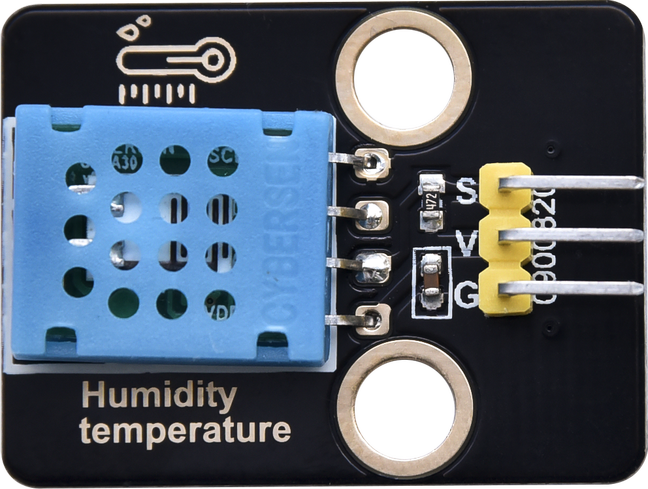
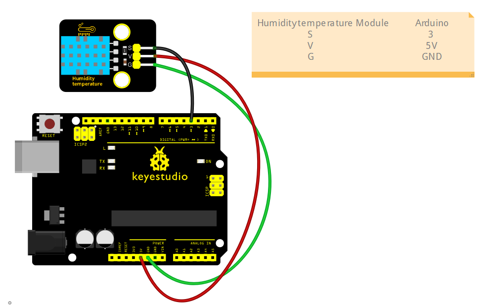

#  keyestudio Humidity temperature Module



## 1. Introduction

This tutorial explains how to use a **DHT11 Temperature and Humidity Sensor Module**.
You will learn how to measure ambient temperature and humidity levels using the sensor.

## 2.Specifications

| Parameter         | Description                        |
| ----------------- | ---------------------------------- |
| Operating Voltage | DC5V                               |
| Control Method    | Arduino digital pin (D0-D13)       |
| Dimensions        | Length：31.5 mm     Width：23.5 mm |

## 3.Required Materials

- Arduino Uno （Compatible with ESP32, STM32, Raspberry Pi, and others）
-  keyestudio Light Sensor (LDR) Module
- Jumper wires

## 4.Wiring Instructions（Arduino UNO R3)

| Humidity temperature Module Pin | Arduino Pin                 |
| ------------------------------- | --------------------------- |
| VCC                             | 5V                          |
| GND                             | GND                         |
| S                               | D3（or other digital pins） |



## 5.Sample Code

Temperature and humidity readings

Read the ambient temperature and humidity and display them in the serial monitor.

```c
#include "DHT.h"

#define DHTPIN 3          // Define the pin where the DHT11 data line is connected
#define DHTTYPE DHT11     // Define the type of DHT sensor used

DHT dht(DHTPIN, DHTTYPE);

void setup() {
  Serial.begin(9600);   // Initialize serial communication at 9600 baud rate
  dht.begin();          // Initialize the DHT sensor
  Serial.println("DHT11 sensor test");
}

void loop() {
  // Read humidity (percentage)
  float humidity = dht.readHumidity();
  // Read temperature in Celsius
  float temperature = dht.readTemperature();

  // Check if any reads failed and exit early (to try again)
  if (isnan(humidity) || isnan(temperature)) {
    Serial.println("Failed to read from DHT sensor!");
  } else {
    Serial.print("Humidity: ");
    Serial.print(humidity);
    Serial.print(" %\t");
    Serial.print("Temperature: ");
    Serial.print(temperature);
    Serial.println(" *C");
  }

  delay(2000);  // Wait a few seconds between measurements
}
```

**Experimental phenomena：**

- After uploading the code to your Arduino and opening the Serial Monitor (set to 9600 baud rate), the Arduino will start reading data from the DHT11 sensor.
- Every approximately 2 seconds, the Serial Monitor will print the current humidity and temperature readings from the sensor.
